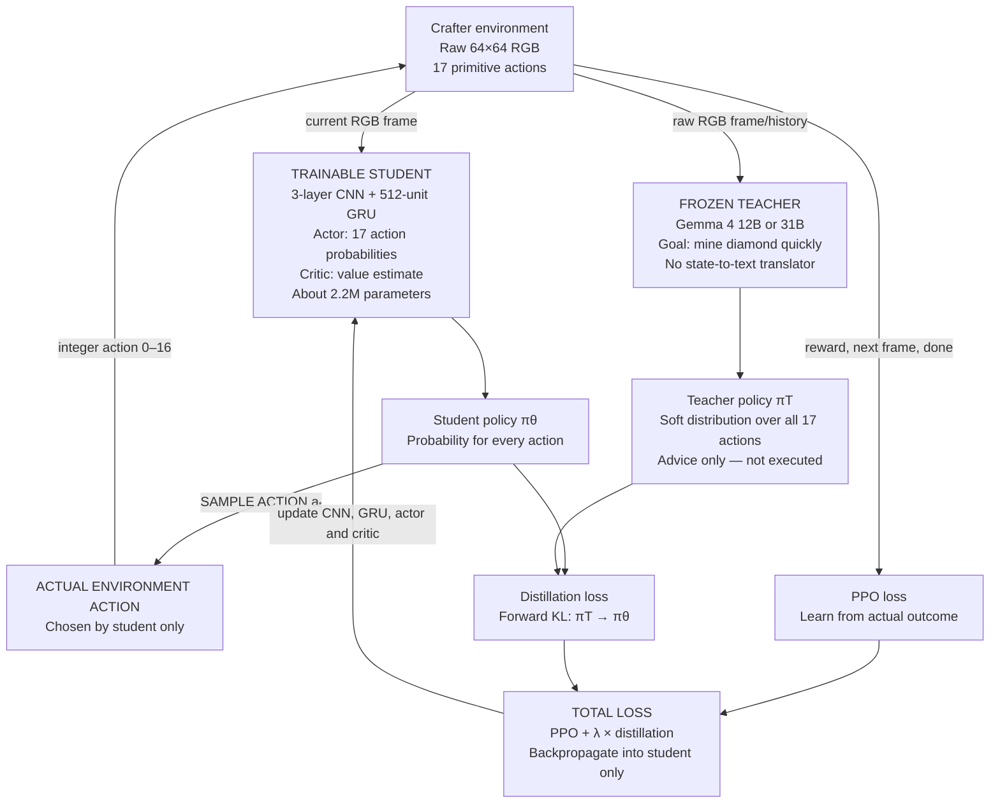
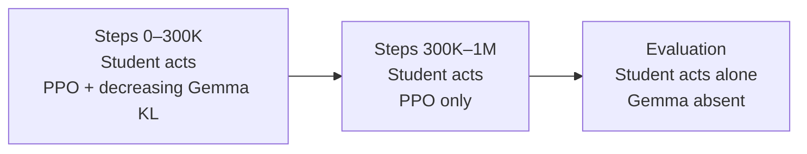

# Vision-LLM4Teach for Crafter

## Experiment specification and architecture

### One-sentence summary

A frozen Gemma 4 vision-language teacher observes raw Crafter images and supplies a soft probability distribution over all 17 primitive actions; a small trainable CNN–GRU student independently chooses and executes the actual action, then learns from both Gemma's soft distribution and Crafter's real rewards.

## Locked decision for experiment 1

The first experiment is **vision-only from the teacher's perspective**:

- Gemma receives raw Crafter images, visual history, the diamond goal and the allowed action names.
- Gemma does **not** receive the environment reward, an interpreted reward message or an outcome report.
- Crafter reward is used only by PPO to train the student.
- Gemma remains frozen and is never updated by gradient descent.
- A reward-aware frozen teacher is reserved for a later controlled ablation.

## The complete architecture



The solid action path is:

```text
student policy → sample student action → Crafter executes it
```

The teacher path is:

```text
Gemma soft probabilities → KL loss → gradient update of student
```

Gemma does **not** take the environment action during the main student-training experiment.

## Components

### 1. Crafter environment

- Environment: original `CrafterReward-v1`.
- Observation: raw RGB image with shape `64 × 64 × 3`.
- Action space: 17 categorical primitive actions.
- Maximum episode horizon: 10,000 environment steps.
- Total training budget: 1,000,000 environment steps across all episodes.
- An episode can end before 10,000 steps if the player dies.
- Primary target: mine at least one diamond during an episode.
- Mining a diamond is recorded as success but does not terminate the standard episode.

The number of episodes is not fixed. If every episode lasted the full 10,000 steps, the 1M-step budget would contain 100 episodes. Early deaths produce more, shorter episodes.

### 2. Trainable student

The student is not an LLM. It is a compact recurrent actor–critic policy proposed for this Crafter experiment.

```text
64×64×3 RGB image
        ↓
Conv2D 3→32, kernel 8, stride 4 + activation
        ↓
Conv2D 32→64, kernel 4, stride 2 + activation
        ↓
Conv2D 64→64, kernel 3, stride 1 + activation
        ↓
Flatten → Linear 512 + activation
        ↓
GRU, hidden size 512
        ↓
 ┌──────────────┴──────────────┐
Actor head                 Critic head
17 action logits           one state value
```

Estimated size: approximately 2.2 million parameters. The exact count will be verified from the implementation.

The actor produces

\[
\pi_\theta(a\mid o_t,h_t),
\]

where \(o_t\) is the current image and \(h_t\) is the student's GRU memory. The critic produces

\[
V_\theta(o_t,h_t).
\]

The GRU helps the student retain episode information that is not recoverable from one partially observable frame.

For comparison, original LLM4Teach used an approximately 24K-parameter CNN actor–critic for MiniGrid and an approximately 10M-parameter student for Habitat. Our 2.2M-parameter Crafter student is a new experimental choice and must be held constant across all teacher and no-teacher conditions.

### 3. Frozen teacher

Two teacher conditions are run separately:

1. Gemma 4 12B Unified, which uses an encoder-free multimodal architecture.
2. Gemma 4 31B Dense, which uses a dedicated vision encoder.

The teacher receives only:

- Raw Crafter image pixels.
- Raw prior frames when the visual-history condition is enabled.
- The fixed goal: mine a diamond as quickly as possible.
- The exact allowed Crafter action names.

In experiment 1 it also does not receive the reward returned after the previous action. Reward is routed exclusively to the student's PPO objective.

The teacher does not receive JSON state, hidden simulator state, an inventory parser, object labels, a scene caption or a symbolic map. Ordinary image resizing, normalization and the deterministic action-name-to-integer API mapping are not semantic translators.

The teacher is frozen throughout the experiment. No Gemma weights are updated.

### 4. Crafter action interface

The allowed action names are:

```text
noop
move_left
move_right
move_up
move_down
do
sleep
place_stone
place_table
place_furnace
place_plant
make_wood_pickaxe
make_stone_pickaxe
make_iron_pickaxe
make_wood_sword
make_stone_sword
make_iron_sword
```

Crafter itself consumes integer actions from 0 through 16. The interface deterministically maps each canonical action name to its integer. It does not interpret the visual observation or plan for the agent.

The teacher should not generate one unconstrained prose answer. Instead, the system scores every valid action candidate. For a multi-token action name, its normalized sequence score is

\[
z_T(a)=\frac{1}{n_a}\sum_{j=1}^{n_a}
\log P(t_j\mid o_{\leq t},g,t_{<j}).
\]

The complete teacher soft target is

\[
\pi_T^\tau(a)=
\frac{\exp(z_T(a)/\tau)}
{\sum_b\exp(z_T(b)/\tau)}.
\]

This retains the relative probabilities of all 17 actions rather than reducing Gemma's advice to a one-hot action.

## One training interaction

At environment step \(t\):

1. Crafter returns raw image \(o_t\).
2. The student computes its policy \(\pi_\theta(\cdot\mid o_t,h_t)\) and value estimate.
3. An action is sampled exclusively from the student policy:

   \[
   a_t\sim\pi_\theta(\cdot\mid o_t,h_t).
   \]

4. Crafter executes \(a_t\), not a teacher action.
5. Crafter returns reward \(r_t\), next image \(o_{t+1}\), achievement information and termination status.
6. The frozen teacher scores all 17 actions for the student-visited observation and supplies \(\pi_T\).
7. The transition and teacher distribution are stored in the on-policy rollout buffer.
8. PPO and distillation losses are calculated.
9. Gradients update only the student.

For efficient execution, the student may first collect a rollout and the frozen teacher may label the stored frames afterward in a batch. This does not change which action was executed: the rollout actions still came from the student policy.

In experiment 1, step 5's reward is available to PPO but is not added to the teacher prompt or teacher context.

## How teacher knowledge updates the student

### Soft policy distillation

The student is trained on Gemma's entire distribution using forward KL divergence:

\[
L_{KD}
=
\tau^2D_{KL}
\left(
\pi_T^\tau\;\Vert\;\pi_\theta^\tau
\right).
\]

Equivalently, because the teacher is frozen, the implementation can minimize soft cross-entropy:

\[
L_{KD}
=
-\tau^2\sum_{a=1}^{17}
\pi_T^\tau(a\mid o_t)
\log\pi_\theta^\tau(a\mid o_t,h_t).
\]

This is the Hinton-style knowledge-distillation component: the student learns not only Gemma's preferred action but also how Gemma ranks the alternatives.

### Environmental reinforcement learning

The PPO component learns from actions that the student actually executed and the outcomes returned by Crafter:

\[
L_{PPO,total}
=
L_{policy}
+c_vL_{value}
-c_eH(\pi_\theta).
\]

### Combined student objective

\[
\boxed{
L_{student}
=
L_{PPO,total}
+\lambda_sL_{KD}
}
\]

- PPO communicates what actually worked in the environment.
- KL distillation communicates what Gemma considered plausible.
- \(\lambda_s\) controls the teacher's influence.
- Only student parameters \(\theta\) receive gradients.

The student's current sampled action is not directly mixed with Gemma's action. It is indirectly guided because previous KL updates have already changed the student policy.

## Teacher-removal schedule

The first complete experiment uses a provisional 300K-step linear schedule:

\[
\lambda(s)=
\begin{cases}
\lambda_0\left(1-\frac{s}{300000}\right), & 0\le s<300000,\\
0, & 300000\le s\le1000000.
\end{cases}
\]



A teacher label means one 17-value soft distribution for one student-visited observation. Therefore, this schedule uses at most 300K Gemma labels while retaining the complete 1M Crafter interaction budget.

Follow-up ablations should compare teacher cutoffs of 100K, 300K and 1M steps rather than treating 300K as inherently optimal.

## Visual-history conditions

The teacher's maximum context capability and its actual populated context are different. Enabling a 256K maximum does not require filling all 256K tokens at every step.

The planned comparison is:

1. Current image only.
2. Current image plus the previous three raw frames.
3. Persistent, rolling episode image history using a KV cache.

When persistent history exceeds the model's context capacity, the oldest history is removed. Context and memory are reset at every episode boundary. The student always maintains its own GRU memory independently of Gemma.

## Later reward-aware teacher ablation

After the vision-only experiment is complete, a frozen Gemma teacher may additionally receive the previous student action and its resulting scalar reward. This would be in-context feedback rather than model training:

```text
Previous student action: do
Environment reward: +1.0
Current observation: [raw image]
Choose probabilities for the next action.
```

The causal order must remain:

```text
teacher advises at time t
→ student executes action at time t
→ environment returns reward at time t
→ reward may be included in the teacher context for time t+1
```

The teacher must never see the reward for an action before that action occurs. A fixed template may translate the scalar into a minimal phrase such as `positive reward`, `zero reward` or `negative reward`, but it must not infer or reveal hidden simulator state.

This condition tests whether a frozen teacher can improve its decisions through in-context environmental feedback. It is deliberately excluded from experiment 1 so that the first result isolates direct visual teaching.

## Experimental conditions

| Condition | Teacher | Student learning | Purpose |
| --- | --- | --- | --- |
| PPO baseline | None | PPO | Determine performance without teaching |
| Gemma 4 12B | Frozen 12B Unified | PPO + soft KL, then PPO | Test encoder-free visual teacher |
| Gemma 4 31B | Frozen 31B Dense | PPO + soft KL, then PPO | Test larger encoder-based teacher |
| Teacher-only diagnostic | Gemma directly selects actions | No student training | Measure teacher competence; not the main method |
| Later reward-aware ablation | Frozen Gemma with previous action and scalar reward in context | PPO + soft KL, then PPO | Test in-context feedback after the vision-only study |

All main conditions use the same student architecture, preprocessing, environment seeds, total step budget and evaluation procedure.

## Crafter success and evaluation

Diamond success is

\[
\text{Diamond success rate}
=
\frac{\text{completed episodes containing a mined diamond}}
{\text{all completed evaluation episodes}}.
\]

An episode that does not mine diamond remains in the denominator. Report:

- Diamond success rate.
- Median and mean step of the first diamond among successful episodes.
- Diamond cumulative success by 1K, 2K, 4K, 6K, 8K and 10K steps.
- Failure-inclusive time-to-diamond metric.
- All 22 Crafter achievement rates.
- Standard Crafter geometric-mean score.
- Total environment reward.
- Teacher–student KL over training.
- Teacher entropy and student entropy.
- Teacher-label throughput, GPU-hours and wall-clock time.
- Final student-only performance after Gemma is removed.

Use multiple random seeds for final comparisons. A one-seed run is only a systems and learning-pipeline validation.

## Hardware plan

For the simplest full-precision setup, use one H200 141GB and run the teachers sequentially:

1. PPO baseline.
2. Gemma 4 12B BF16 teacher run.
3. Gemma 4 31B BF16 teacher run.

One H200 avoids tensor-parallel communication and provides enough memory for the 31B weights, a large KV cache, inference workspace and the small PPO student.

With multiple GPUs:

- For 12B, place a complete teacher replica on each sufficiently large GPU and divide independent episode streams between them.
- For 31B, use one replica per H200 when possible.
- Alternatively, shard 31B across two H100 80GB or two A100 80GB GPUs using tensor parallelism and a fast interconnect.
- Multiple GPU memories combine only when the inference engine explicitly shards the model. Independent replicas increase throughput but do not pool VRAM.

## Relationship to original LLM4Teach

The experiment retains:

- A frozen large teacher.
- A lightweight trainable RL student.
- Student-generated on-policy trajectories.
- A soft teacher policy.
- PPO/environmental learning plus policy distillation.
- Annealed teacher influence.
- Student-only deployment.

The experiment deliberately changes:

- Textual symbolic teacher input becomes raw visual input.
- LLM-selected high-level options are removed.
- Fixed option/skill controllers are removed.
- Gemma directly scores the primitive Crafter action space.

Consequently, this should be described as a **direct-vision, primitive-action adaptation of LLM4Teach**, not an exact reproduction of the original architecture.

## Minimal implementation order

1. Implement and validate the CNN–GRU PPO student without a teacher.
2. Verify the 1M-step and 10K-episode-horizon accounting.
3. Build constrained scoring for all 17 canonical action names.
4. Run a teacher-only perception/action diagnostic on representative Crafter frames.
5. Add soft teacher distributions to the rollout buffer.
6. Add KL distillation and the teacher-weight schedule.
7. Run a short end-to-end smoke test.
8. Run Gemma 4 12B first.
9. Run Gemma 4 31B after the pipeline is validated.
10. Run multiple seeds and teacher-cutoff/context ablations.
11. Only afterward, add the reward-aware frozen-teacher ablation.

## References

- [LLM4Teach paper](https://arxiv.org/abs/2311.13373)
- [LLM4Teach implementation](https://github.com/ZJLAB-AMMI/LLM4Teach)
- [Original Crafter environment](https://github.com/danijar/crafter)
- [Gemma 4 technical report](https://arxiv.org/abs/2607.02770)
- [Distilling the Knowledge in a Neural Network](https://arxiv.org/abs/1503.02531)
